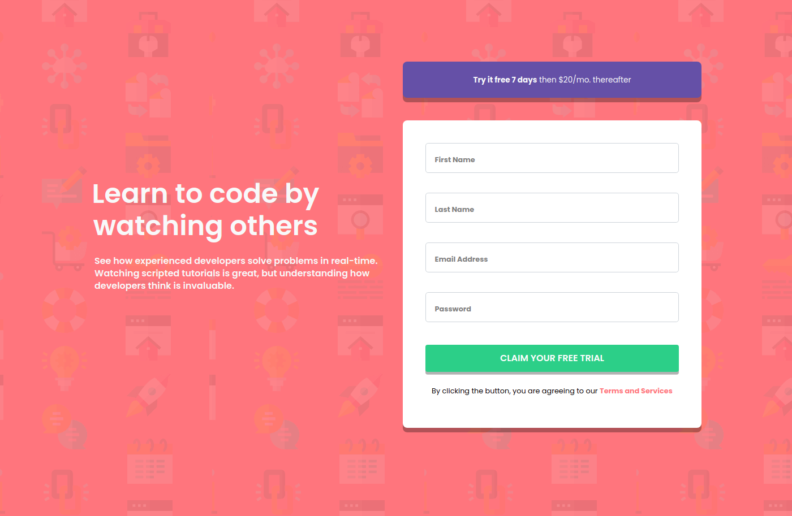

# Frontend Mentor - Intro component with sign up form solution

This is a solution to the [Intro component with sign up form challenge on Frontend Mentor](https://www.frontendmentor.io/challenges/intro-component-with-signup-form-5cf91bd49edda32581d28fd1). Frontend Mentor challenges help you improve your coding skills by building realistic projects. 

## Table of contents

- [Overview](#overview)
  - [The challenge](#the-challenge)
  - [Screenshot](#screenshot)
  - [Links](#links)
- [My process](#my-process)
  - [Built with](#built-with)
  - [What I learned](#what-i-learned)
  - [Useful resources](#useful-resources)
- [Author](#author)

## Overview

### The challenge

Users should be able to:

- View the optimal layout for the site depending on their device's screen size
- See hover states for all interactive elements on the page
- Receive an error message when the `form` is submitted if:
  - Any `input` field is empty. The message for this error should say *"[Field Name] cannot be empty"*
  - The email address is not formatted correctly (i.e. a correct email address should have this structure: `name@host.tld`). The message for this error should say *"Looks like this is not an email"*

### Screenshot

### Links

- Solution URL: [Frontend Mentor](https://www.frontendmentor.io/solutions/first-steps-in-bootstrap-4-in-responsive-intro-component-mIHTpsh6m)
- Live Site URL: [GitHub Pages](https://icewarrior01.github.io/Intro-component-with-signup-form/)

## My process

### Built with

- Semantic HTML5 markup
- CSS custom properties
- Mobile-first workflow
- [Bootstrap 4](https://getbootstrap.com/) - Front-End toolkit

### What I learned

I learned how to make web page using Bootstrap.

### Useful resources

- [Input group Bootstrap](https://getbootstrap.com/docs/4.0/components/input-group/) - This helped me to customize input fields. I really liked this pattern and will use it going forward.
- [Forms Bootstrap](https://getbootstrap.com/docs/4.6/components/forms/) - This is an amazing article which helped me finally understand how to make bootstrap forms. I'd recommend it to anyone still learning this concept.

## Author
- Frontend Mentor - [@IcEWaRRiOr01](https://www.frontendmentor.io/profile/IcEWaRRiOr01)
